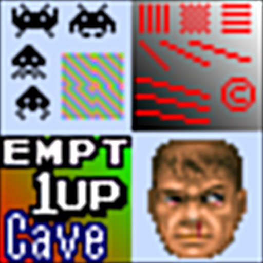

# windowed

## Background

## Preview Image

* jinc2-sharp

* jinc2-sharper

* jinc2

* lanczos16

## Comments

## External Links

* [Slang Shaders](https://github.com/libretro/slang-shaders)
* [GLSL Shaders](https://github.com/libretro/glsl-shaders)
* [CG Shaders](https://github.com/libretro/common-shaders)
