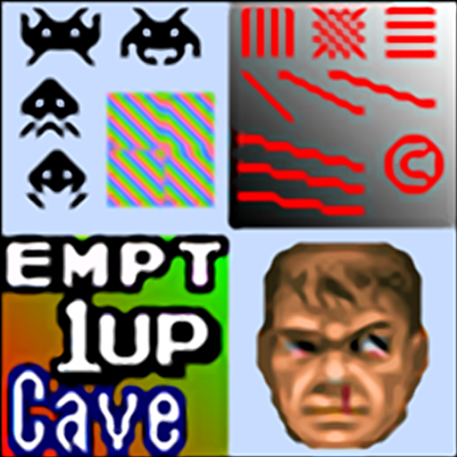
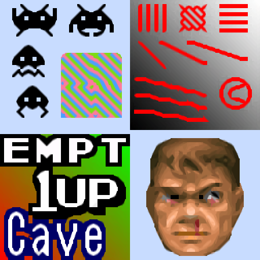

# xbr

## Background

## Preview Image

* 2xbr-lv1-multipass

* super-xbr-2p

* super-xbr-3p-smoother

* super-xbr-6p

* super-xbr-fast-3p

* super-xbr-fast-6p

* xbr-hybrid

* xbr-lv1-noblend

* xbr-lv2-fast

* xbr-lv2-multipass

* xbr-lv2-noblend

* xbr-lv2

* xbr-lv3-multipass

* xbr-lv3-noblend

* xbr-lv3

* xbr-mlv4-dilation

* xbr-mlv4-multipass

## Comments

## External Links

* [Slang Shaders](https://github.com/libretro/slang-shaders)
* [GLSL Shaders](https://github.com/libretro/glsl-shaders)  
* [CG Shaders](https://github.com/libretro/common-shaders)
