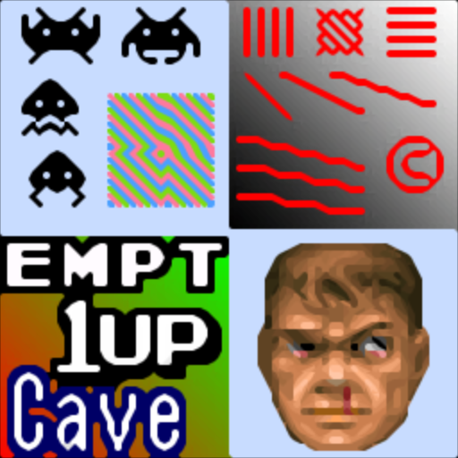

# xbrz

## Background

## Preview Image

* 4xbrz

* 5xbrz

* 6xbrz

## Comments

## External Links

* [Slang Shaders](https://github.com/libretro/slang-shaders)
* [GLSL Shaders](https://github.com/libretro/glsl-shaders)  
* [CG Shaders](https://github.com/libretro/common-shaders)
