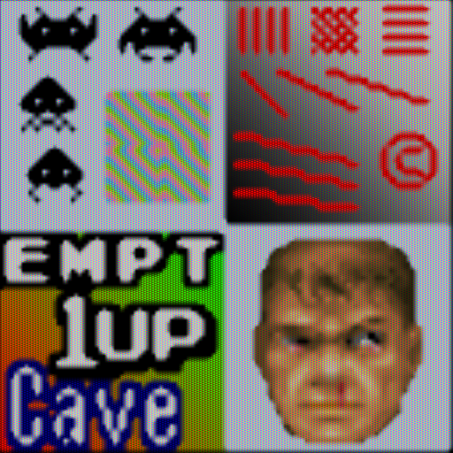
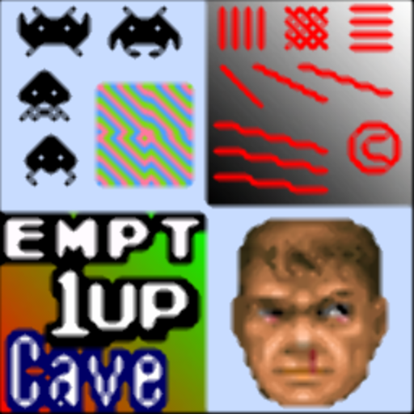

# xsal

## Background

## Preview Image

* 2xsal-level2-crt

* 2xsal

* 4xsal-level2-crt

* 4xsal-level2-hq

* 4xsal-level2

## Comments

## External Links

* [Slang Shaders](https://github.com/libretro/slang-shaders)
* [GLSL Shaders](https://github.com/libretro/glsl-shaders)
* [CG Shaders](https://github.com/libretro/common-shaders)
