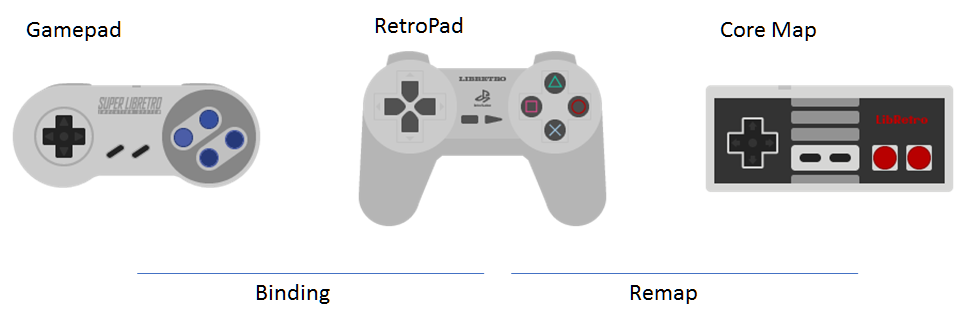

# The RetroPad Abstraction

The **RetroPad** is a joypad abstraction interface defined by the Libretro API. It is the primary input device for a libretro frontend. Unless a core absolutely requires the use of a keyboard with no possible fallback for gamepad-type controls, a [[Libretro core]] should always be implemented as such that it is directly controllable by the RetroPad.

In terms of button layout and functionality, the RetroPad is based on a PlayStation/Super Nintendo joypad.

## Definition/Criteria
The minimum implementation required for the RetroPad abstraction:

* At least two shoulder buttons
* At least four face buttons
* At least one D-pad
* At least one analogue stick
* A `Start` button and a `Select`/`Back` button.

Above: An example of the RetroPad joypad abstraction mapped to the Megadrive 6-Button gamepad.

### Parallel port joypads in Linux
RetroArch supports parallel port joypads on Linux via the "parport" joypad driver. It uses an extended version of the Linux Multisystem 2-button joystick protocol.

| Function | Pin | Register | Bit | Active |
|----------|-----|----------|-----|--------|
| Up | 2 | Data | 0 | Low |
| Down | 3 | Data | 1 | Low |
| Left| 4 | Data | 2 | Low |
| Right| 5 | Data | 3 | Low |
| A | 6 | Data | 4 | Low |
| B | 7 | Data | 5 | Low |
| Start | 8 | Data | 6 | Low |
| Select | 9 | Data | 7 | Low |
| Menu toggle | 10 | Status | 6 | Low |
| X | 11 | Status | 7 | Low* |
| Y | 12 | Status | 5 | Low |
| L1 | 13 | Status | 4 | Low |
| R1 | 15 | Status | 3 | Low |

(*) Pin is hardware inverted, but RetroArch inverts it back again so the same pullup scheme may be used for all pins. Pin 1 is set high so it can be used for pullups.

RetroArch does not perform debouncing, and so long as the button settling time is less than the frame time no bouncing will be observed. This replicates the latching behavior common in old games consoles. For optimum latency and jitter a high performance debouncing routine should be implemented in the controller hardware.

Parallel port hardware does not provide a way to detect non-connected pins. To avoid rendering the menu usable with spurious button presses, RetroArch checks each pin on startup and assumes any active pin is not connected. Avoid holding joypad buttons while starting RetroArch or those buttons will be disabled.
