---
hide:
  - navigation
  - toc
---

# Start Point

RetroArch is a versatile emulator that has been successfully ported to a wide range of platforms. With its ability to run on numerous PC operating systems such as Windows, macOS, and Linux, as well as home consoles like PlayStation 3, Xbox 360, and Wii U, RetroArch offers a comprehensive gaming experience to its users. It is also compatible with handheld consoles like PlayStation Vita and Nintendo 3DS, as well as smartphones running on Android and iOS. 

In addition to these platforms, RetroArch can also be run on single-board computers such as Raspberry Pi and ODROID. Moreover, with the use of the Emscripten compiler, RetroArch can even be accessed through web browsers. The latest stable version of RetroArch is {{ unit.stable }}, and it is regularly updated throughout the month to ensure optimal performance and compatibility. Whether you're a gaming enthusiast or a software developer, RetroArch is an excellent choice for emulating retro games and enjoying a nostalgic gaming experience.

## Downloading

To get started with RetroArch, the first step is to download the application. While some systems may have RetroArch available in their official store or an alternative store, it's also possible to download it directly from the RetroArch website. When downloading, be sure to choose a trusted source that has been approved by LibRetro or is LibRetro itself to ensure a safe and reliable download. Don't hesitate to download from these sources as they are verified by the RetroArch community.

!!! example

    === "Windows"

        Store:

        * [Steam](https://store.steampowered.com/app/1118310/RetroArch/)
        * [Itch.io](https://retroarchofficial.itch.io/retroarch)

        Main:

        * [Buildbot](http://buildbot.libretro.com/stable/{{ unit.stable }}/windows/)

    === "Android"

        Store:

        * [Google Play](https://play.google.com/store/apps/details?id=com.retroarch&hl=tr&gl=US)
        * [Amazon](https://www.amazon.com/Gadsby-RetroArch/dp/B09753XRVF)

        Main:

        * [Buildbot](http://buildbot.libretro.com/stable/{{ unit.stable }}/android/)
        
    As you can see here, Google Play installation and distribution was made by LibRetro, while Amazon was done by Gadsby. This is a rare event. In some cases, we may need to perform the distribution outside of our original account. The reasons for this can be technical as well as bureaucratic. We report these situations and external uploads made on the link that we did not report or share do not belong to us.

Now that we've talked about our download sources, we can come to the download stages. You can use one of the two channels for this. One of them is our [original website](https://www.retroarch.com/index.php?page=platforms) and the other is the [buildbot](http://buildbot.libretro.com/stable/{{ unit.stable }}) where our application is produced. It downloads from the same source on both links, so you can use both.

After entering the website, you will encounter the situation where you can use one of the two download options. This is apply for most platforms. These options are divided into two as Stable and Nightly. Let's get to know these options closely:

=== "Stable"

	The stable version is our first priority and the main distribution version. Since it is the major release, it comes out periodically. Stable releases take more time to manufacture, but new features become available in the next version. For example: A version can have a new theme and feature, and in the next version, this theme and feature can be removed, improved or changed. As can be understood from the name of Stable, this version is more stable because it is controlled accordingly to make it work better on the platform it is suitable for.

=== "Nightly"

	This version contains the latest commits available on GitHub, and the latest enhancements and features are added daily. This version may not be as stable as Stable version because it is build daily, but this does not mean that it is not stable.

So how do you decide which of these options is right for you? This is hidden in the answer to one of the two questions below.

{==

After you decide which version to install, you can go to the appropriate [installation steps](../guides/install-windows.md) for your platform. 

==}

If the installation is finished, you can continue with the [love at first sight](love-at-first-sight.md) page.
