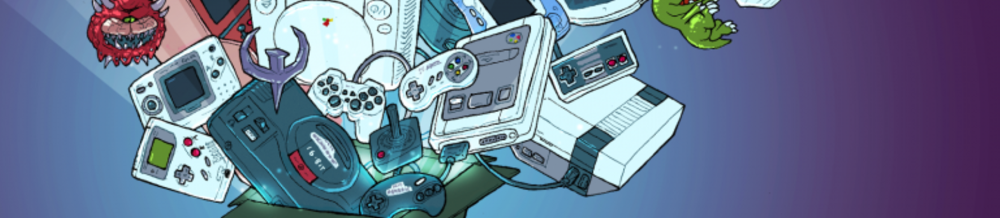

---
hide:
  - navigation
  - toc
---

# Understanding Basics

RetroArch is a frontend for emulators, game engines and media players.

## What RetroArch is

It runs programs converted into dynamic libraries called libretro cores, using several user interfaces such as command-line interface, a few graphical user interfaces optimized for gamepads, several input, audio and video drivers, plus other sophisticated features like dynamic rate control, audio filters, multi-pass shaders, netplay, gameplay rewinding, cheats, etc.Settings are also unified so configuration is done once and for all.

In addition to this, you are able to run original game discs (CDs) from RetroArch.

### What RetroArch is not 

RetroArch is not a computer program that includes all consoles and games. It is not a service that allows you to download copyrighted games or content. It is not an application that will cause you to modify the application to the platform on which you will install it, but in order to run unsigned applications on some platforms, the default firmware needs to be modified.

## What is LibRetro

Libretro is a simple API that allows for the creation of games and emulators. It is very simple in nature, yet very powerful. The simplicity of it all requires some explanation in order to truly grasp how useful it can be to your own projects.

When you choose to use the libretro API, your program gets turned into a single library file (called a ‘libretro core’). A frontend that supports the libretro API can then load that library file and run the app. The frontend’s responsibility is to provide all the implementation-specific details, such as video/audio/input drivers. The libretro core’s responsibility is solely to provide the main program. You therefore don’t have to worry about writing different video drivers for Direct3D, OpenGL or worrying about catering to all possible input APIs/sound APIs/supporting all known joypads/etc. This is none of your concern at the libretro core implementation level.

## Logo/Mascott

{ align=left }
We call them as Invader but you can call it *Nice Little Pixel*, it was drawn from scratch by talented [Agnes Heyer](https://twitter.com/agnesheyer) and it has a completely different visual style.

Let's continue if we understood LibRetro and RetroArch. Click [here](installation.md) to get started.